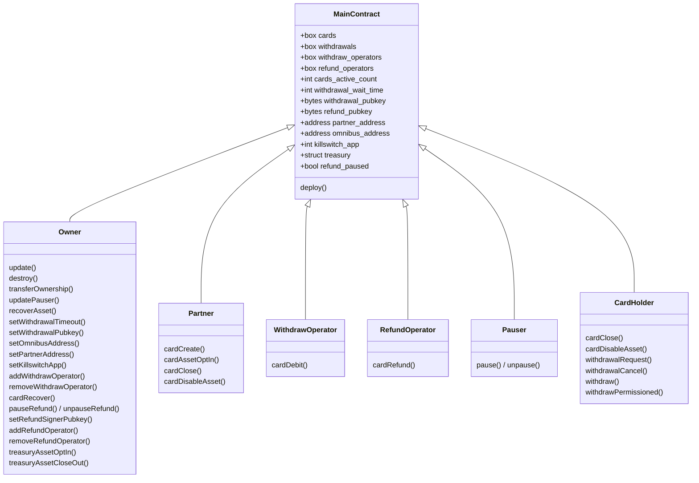
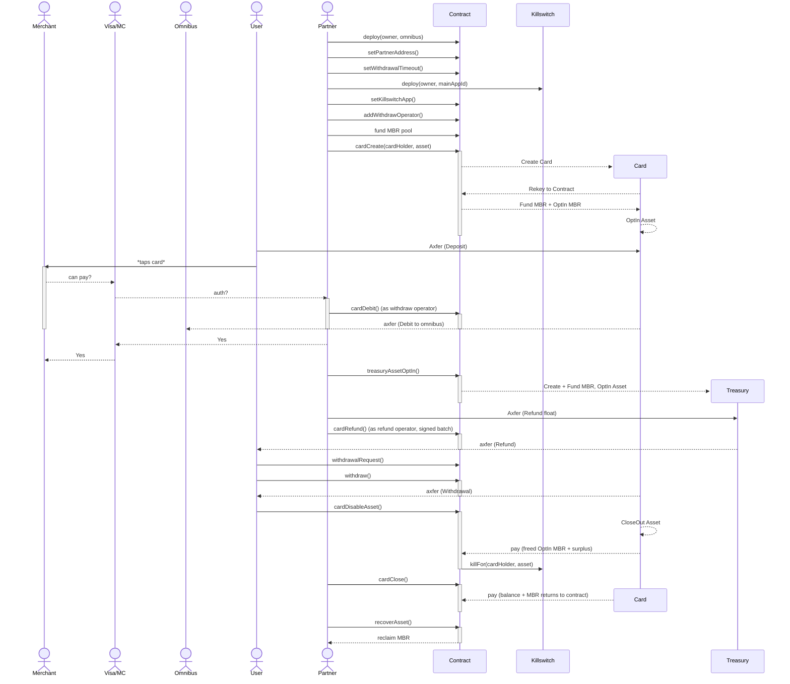

# auto-draw-card

An Algorand smart-contract project (built with [AlgoKit](https://github.com/algorandfoundation/algokit-cli) and Algorand TypeScript) implementing a card-management system with an opt-in automated debit flow. See [Getting started](#getting-started) for setup.

## Concept

This project is built around a **Main** contract that "generates" a new address for each card that's created. Every card is a rekeyed account controlled by the contract.

All minimum balance requirements (MBR) — box storage, account minimum balances and asset opt-in MBR — are **pre-funded by the contract owner**. Callers never attach MBR payments: `cardAssetOptIn` tops a card up from the contract escrow if it cannot cover the opt-in itself. MBR flows back the same way. When a card is closed, the freed MBR returns to the contract and the owner can reclaim it with `recoverAsset`. When a card opts out of an asset (`cardDisableAsset`), the freed opt-in MBR — along with any other surplus Algo on the card — is swept back to the contract too.

The contract also controls a **refund treasury** — another rekeyed account, used to pay out signed refund batches (see [Refunds](#refunds)). It follows the same MBR pattern: created and funded from the contract escrow on its first asset opt-in (`treasuryAssetOptIn`), swept back to the contract on close-out (`treasuryAssetCloseOut`) and when the contract is destroyed.

Two auxiliary contracts support an automated draw ("AutoDraw") flow on top of the Main contract:

- **Main** ([smart_contracts/main/contract.algo.ts](./smart_contracts/main/contract.algo.ts)) — the card-management application. Documented under [Main contract](#main-contract).
- **Killswitch** ([smart_contracts/killswitch/contract.algo.ts](./smart_contracts/killswitch/contract.algo.ts)) — an application that records which accounts have opted in to AutoDraw delegation, so they can disable it at any time. Documented under [Killswitch contract](#killswitch-contract).
- **AutoDraw** ([smart_contracts/auto_draw/contract.algo.ts](./smart_contracts/auto_draw/contract.algo.ts)) — a delegated `LogicSig` that authorizes an automatic debit from a card, gated by the Killswitch. Documented under [AutoDraw logic signature](#autodraw-logic-signature).

## Roles

- **Owner** — administers the contract: recovers cards, authorizes withdraw and refund operators, configures the contract (partner address, omnibus address, killswitch app, withdrawal timeout, withdrawal and refund public keys), manages the refund treasury and refund pause, and reclaims MBR. Inherited from `Ownable` and transferable via `transferOwnership`.
- **Partner** — operates the card lifecycle: creates/closes cards and opts cards in/out of assets. Set by the owner via `setPartnerAddress`.
- **Withdraw operator** — debits cards to the omnibus address via `cardDebit`. Authorized and revoked by the owner (`addWithdrawOperator` / `removeWithdrawOperator`), so debit processing can run from an operational key that holds no other privileges.
- **Refund operator** — submits signed refund batches via `cardRefund`, paying recipients out of the treasury. Authorized and revoked by the owner (`addRefundOperator` / `removeRefundOperator`); the operator can only submit batches Partner has signed, never mint its own.
- **Pauser** — can `pause`/`unpause` the contract, halting debits. Inherited from `Pausable` and updatable via `updatePauser`. (Refunds have a separate, owner-gated pause — see [Refunds](#refunds).)
- **Card holder** — the account assigned as a card's `owner`. Can close the card, opt the card out of assets, and initiate/cancel/execute withdrawals.

## Design assumptions

**Partner enforces one active card per holder off-chain**, at card issuance. The contracts deliberately do not enforce it: `cardRecover` can hand a holder a second card directly, and on-chain logic is written to stay correct either way — the `CARD_MISMATCH` guard in `withdraw` exists for precisely that case.

Two consequences follow from keying state by holder rather than by card, and both are intended behaviour:

- A holder has a single withdrawal-request slot covering all of their cards (`withdrawals` is keyed by the requesting account).
- Revoking a holder's AutoDraw delegation applies to every card they own (the Killswitch keys delegation by `(account, asset)`).

The authoritative statement of this trust model is the comment block above `export class Main` in [smart_contracts/main/contract.algo.ts](./smart_contracts/main/contract.algo.ts).

## Main contract

The card-management application. Its methods are grouped below.

### Administration

#### deploy(address,address)address

Deploy the contract, setting the first address as the owner and the second as the omnibus address. The transaction sender becomes the initial pauser. Returns the contract application address. The refund treasury starts as the zero address — it is created by the first `treasuryAssetOptIn`, since the app account holds nothing to fund it with at creation time.

#### update()void

Allows the owner to update the contract.

#### destroy()void

Destroy the contract, returning all Algo to the owner — including anything left on the treasury, which is closed back to the contract first (the treasury is rekeyed to the app, so its balance would otherwise be stranded behind a deleted authorizer). Only possible when there are no active cards, and the treasury must already be closed out of every asset.

#### transferOwnership(address)void / owner()address

Transfer or read contract ownership.

#### pause()void / unpause()void / pauser()address / updatePauser(address)void

Pause/unpause the contract and manage the pauser role.

#### recoverAsset(uint64,uint64,address)void

Allows the owner to recover Algo (asset `0`) or any ASA held by the contract — used to reclaim MBR that has returned to the contract. Args: `asset, amount, recipient`.

### Configuration

#### setWithdrawalTimeout(uint64)void

Owner-only. Set the number of seconds a permissionless withdrawal request must wait before it can be executed.

#### setWithdrawalPubkey(byte[32])void

Owner-only. Set the ed25519 public key used to authorize permissioned withdrawals.

#### setOmnibusAddress(address)void

Owner-only. Set the omnibus address that debited funds are sent to (readable via the `omnibus_address` global state).

#### setPartnerAddress(address)void

Owner-only. Set the partner address that operates the card lifecycle (readable via the `partner_address` global state).

#### setKillswitchApp(uint64)void

Owner-only. Register the Killswitch application whose AutoDraw delegations are revoked when a card opts out of an asset (readable via the `killswitch_app` global state). The two contracts reference each other, so this is a post-deploy step — see [Killswitch contract](#killswitch-contract). While unset, `cardDisableAsset` skips delegation cleanup, so a deployment that does not use AutoDraw needs no killswitch at all. Owner-controlled rather than passed per call, so a caller cannot point revocation at a look-alike contract and leave the real delegation in place.

### Withdraw operators

#### addWithdrawOperator(address)void

Owner-only. Authorize an account to call `cardDebit`, writing a box keyed by that account (MBR owner-funded).

#### removeWithdrawOperator(address)void

Owner-only. Revoke a withdraw operator, deleting its box and releasing the MBR back to the contract. Re-granting later is supported.

### Cards

#### cardCreate(address,uint64)address

Partner-only. Generates a brand new rekeyed account for the given card holder and funds its minimum balance from the contract. If an asset is provided (non-zero), also funds the asset opt-in MBR and opts the card into that asset. Returns the new card address.

#### cardAssetOptIn(address,uint64)void

Partner-only. Opts a card into an asset, funding any shortfall in the card's minimum balance requirement from the contract escrow — the caller does not have to pre-fund the card. Fails with `ASSET_ALREADY_ENABLED` if the card already holds the asset, so a redundant opt-in costs nothing.

#### cardClose(address)void

Partner or card holder. Closes the card account back to the contract and deletes its box, returning all balances and MBR to the contract. Also drops any pending withdrawal request that targets this card, so the request box cannot outlive the card it points at. The card must already be opted out of every asset (Algorand forbids closing an account that still holds an ASA), which is why AutoDraw delegation cleanup lives in `cardDisableAsset` rather than here.

#### cardRecover(address,address)void

Owner-only. Reassigns a card to a new card holder and emits `CardRecovered`. Any pending withdrawal request the previous holder had against this card is cleared, since it is keyed by their account and the new holder could neither complete nor cancel it.

#### cardDisableAsset(address,uint64)void

Partner or card holder. Closes the card out of an asset and sweeps the Algo the card no longer needs — the freed opt-in MBR plus any other surplus — back to the contract, leaving the card at exactly its remaining minimum balance. Also revokes the card holder's AutoDraw delegation for that asset, via an inner `killFor` call to the registered killswitch app. Three inner transactions in total, so callers must budget roughly 3_000 µAlgos of extra fee. Revocation is best-effort: an asset the holder never delegated closes out normally.

This is where delegation cleanup belongs because it is unavoidable. A card cannot be closed while it still holds an ASA, so every asset a card ever held passes through this method, and it is the point at which the asset can no longer be drawn into the card.

#### getCardData(address)(address,address,uint64,uint64)

Returns a card's `(owner, address, nonce, withdrawalNonce)`.

#### getNextCardNonce(address)uint64

Read a card's debit nonce. (The withdrawal nonce is available via `getCardData`.)

### Debits

#### cardDebit(address,address,uint64,uint64,uint64,string)void

Withdraw-operator only, when not paused — the account must hold a box granted by `addWithdrawOperator`; contract ownership alone does not authorize a debit. Debits an amount of an asset from a card directly to the omnibus address. Args: `cardOwner, card, asset, amount, nonce, reference`. Asserts `cardOwner` owns `card` (the guard the AutoDraw flow relies on), attaches the reference as the transfer note, and increments the card's debit nonce.

### Withdrawals

#### withdrawalRequest(address,uint64,uint64)(...)

Card holder. Creates a permissionless withdrawal request for `card, asset, amount` (only one request per card holder at a time). Returns the stored request.

#### withdrawalCancel(address)void

Card holder. Cancels a pending withdrawal request.

#### withdraw(address,uint64)void

Card holder. Executes a pending permissionless withdrawal once the wait time has elapsed. Args: `card, amount`.

#### withdrawPermissioned(address,uint64,uint64,uint64,uint64,byte[64])void

Card holder. Executes a withdrawal before the wait time elapses, authorized by an ed25519 signature from the withdrawal public key. Args: `card, asset, amount, expiresAt, nonce, signature`.

### Refunds

Refunds compensate card debits that have already settled on chain. A `cardDebit` inner transfer is final once committed, so a refund is a _forward_ payment out of a dedicated **treasury** account — a rekeyed contract-controlled account, like a card — rather than a reversal out of the omnibus. Refund batches are authorized off-chain: Partner signs the batch with the refund signer key (registered via `setRefundSignerPubkey`), and an authorized refund operator submits it.

Refunds carry their own pause switch (`refund_paused`), separate from the contract-wide `paused` flag, so halting refunds does not halt debits and vice versa. Unlike the contract-wide pause it is owner-gated rather than carrying its own pauser role.

#### treasuryAssetOptIn(uint64)address

Owner-only. Opts the treasury into an asset so refunds of that asset can be paid from it, and returns the treasury address (also readable via the `treasury` global state). The first call creates the treasury: a freshly rekeyed account must be funded to its minimum balance in the same group as its rekey, and the app account is unfunded at creation time, so the first opt-in creates, rekeys and funds it from the contract escrow in one call — four inner transactions; later opt-ins need at most two. Any minimum-balance shortfall is always covered from the escrow, and a redundant opt-in fails with `ASSET_ALREADY_ENABLED`.

#### treasuryAssetCloseOut(uint64,address)void

Owner-only. Closes the treasury out of an asset, sending any remaining balance — live refund float, unlike a card's drained holding — to the given `closeTo` account, which must already hold the asset. The freed opt-in MBR plus any surplus Algo is swept back to the contract, leaving the treasury at exactly its remaining minimum balance. Args: `asset, closeTo`.

#### cardRefund((address,uint64)[],uint64,uint64,uint64,byte[64])void

Refund-operator only, when refunds are not paused. Pays a signed batch of up to 16 `(recipient, amount)` transfers of one asset out of the treasury. Args: `transfers, asset, expiresAt, nonce, signature`.

The contract rebuilds the signed payload from its own state — treasury address, genesis hash — plus the call arguments, SHA-256 hashes its ARC-4 encoding, and verifies the ed25519 signature against the refund signer key, so a signature minted for a different treasury, network, batch or nonce cannot verify here. The treasury nonce makes each signature single-use, and the batch is atomic: every recipient is paid or none is. Zero amounts are counted but not transferred. Emits one `Refund` event summarizing the batch (`treasury, asset, count, total, expiresAt, nonce`).

Two group-level requirements are the caller's to satisfy: every recipient holding plus the treasury holding must be made available through the group's account references (four accounts per app call, shared group-wide, so a full 16-recipient batch needs four extra pad app calls — which also raise the group's pooled inner-transaction and opcode budgets), and the group must carry one minimum fee per inner transaction: the transfers themselves plus whatever `ensureBudget` issues to buy opcode budget for the signature check.

#### pauseRefund()void / unpauseRefund()void

Owner-only. Halt or resume refunds without touching the contract-wide pause. State readable via the `refund_paused` global.

#### setRefundSignerPubkey(byte[32])void

Owner-only. Set the ed25519 public key refund batch signatures are verified against. Rotating it invalidates every unsubmitted signature, which is the intended emergency response.

#### addRefundOperator(address)void / removeRefundOperator(address)void

Owner-only. Grant or revoke an account's permission to submit `cardRefund` batches, via a box keyed by that account (MBR owner-funded, released on removal).

#### getNextTreasuryNonce()uint64

Read the next treasury nonce, needed to sign a refund batch.

## Killswitch contract

A standalone application ([smart_contracts/killswitch/contract.algo.ts](./smart_contracts/killswitch/contract.algo.ts)) that maintains an opt-in registry of `(account, asset)` pairs allowed to use the AutoDraw delegation. It lets a card holder enable AutoDraw per asset and, crucially, disable ("kill") it at any time. It inherits `Ownable`, `Pausable` and `Recoverable`, so it also supports `transferOwnership`, `pause`/`unpause`/`updatePauser`, and `recoverAsset`.

Each enabled delegation is stored in a box keyed by the 32-byte account address concatenated with the 8-byte asset id (MBR owner-funded); enabling is gated by Main card ownership to prevent abuse of that box MBR. Because the key is the _holder's_ account rather than a card, a delegation covers every card that holder owns — see [Design assumptions](#design-assumptions).

The two contracts reference each other. Killswitch takes the Main application ID at deploy time and uses it both to verify card ownership in `enable` and to gate `killFor`; Main learns the Killswitch application ID afterwards, via the owner-only `setKillswitchApp`. Deploy order therefore matters, and [smart_contracts/killswitch/deploy-config.ts](./smart_contracts/killswitch/deploy-config.ts) handles both directions: it resolves (or idempotently deploys) Main first, then writes the back-reference — warning rather than failing if the deploying account does not hold the Main owner key.

A holder's delegation is revoked automatically when their card opts out of the asset (`Main.cardDisableAsset`), in addition to whenever they call `kill` themselves.

### Methods

#### deploy(address,uint64)address

Deploy the contract, setting the first address as the owner and the `uint64` as the Main application ID used to verify card ownership. The transaction sender becomes the initial pauser. Returns the contract application address.

#### enable(address,uint64)void

Opt the caller in to AutoDraw delegation of the given asset. The caller must pass a `card` address they own; ownership is verified via a cross-contract `getCardData` call to the Main contract. Fails if already enabled for that asset (`ALREADY_ENABLED`), if the card is not opted into the asset (`ASSET_NOT_ALLOWED`), or if the caller does not own the card (`NOT_CARD_OWNER`). Creates the caller's `(account, asset)` box.

#### kill(uint64)void

Opt the caller out of AutoDraw delegation of the given asset, deleting their `(account, asset)` box. Fails if not currently enabled for that asset.

#### killFor(address,uint64)void

Revokes the given `account`'s delegation for an asset. Callable **only** as an inner call from the registered Main application (`SENDER_NOT_ALLOWED` otherwise) — `kill` keys off `Txn.sender`, so a contract acting for a holder needs the account passed explicitly, and leaving that reachable externally would let anyone disable any holder's automated draws. Unlike `kill`, a delegation that is not enabled is a no-op rather than an error, so an asset opt-out is never blocked by an absent delegation.

#### authorize(address,uint64)void

When not paused, asserts that the given `account` has AutoDraw enabled for the given `asset` (`REFUSED` otherwise). Called as part of the AutoDraw transaction group to confirm delegation is still active; pausing the contract or the account calling `kill()` halts further draws.

## AutoDraw logic signature

A delegated `LogicSig` ([smart_contracts/auto_draw/contract.algo.ts](./smart_contracts/auto_draw/contract.algo.ts)) that authorizes an automatic debit ("draw") of an asset from the delegating account. It is parameterized with template variables `GENESIS_HASH`, `KILLSWITCH_APP` and `MAIN_APP`, and only approves a transaction that satisfies all of the following:

- It is a fee-0 asset transfer, with no rekey and no asset close-out, on the expected network (`GENESIS_HASH`).
- The next transaction (group index +1) is a `Killswitch.authorize` call to `KILLSWITCH_APP` whose `account` argument matches the transfer sender and whose `asset` argument matches the transferred asset.
- The transaction after that (group index +2) is a `Main.cardDebit` call to `MAIN_APP` whose `cardOwner`, `card`, `asset` and `amount` arguments match the transfer's sender, receiver, asset and (as an upper bound) amount.

This enforces that an automated draw can only happen alongside an active per-asset Killswitch authorization and a matching Main debit, that the drawn amount never exceeds the debited amount, and — because `cardDebit` verifies `cardOwner` owns `card` — that funds can only ever flow into a card the delegator owns rather than any card the Main contract happens to debit. The asset is not baked into the Lsig itself: which assets may be drawn is controlled by the per-`(account, asset)` Killswitch delegation.

## Contract diagram



## Lifecycle



# Getting started

### Prerequisites

- [Node.js 22+](https://nodejs.org/en/download)
- [AlgoKit CLI 2.6+](https://github.com/algorandfoundation/algokit-cli?tab=readme-ov-file#install)
- [Docker](https://www.docker.com/) — required to run LocalNet
- [Puya compiler](https://pypi.org/project/puyapy/) (installed via AlgoKit)

### Install, build & test

```bash
pnpm install              # install dependencies
algokit localnet start    # start a local Algorand network (Docker)
pnpm build                # compile the contracts and regenerate the typed clients
pnpm test                 # run the test suite against LocalNet
```

Other scripts: `pnpm lint`, `pnpm check-types`, `pnpm format`, and `pnpm deploy` (deploys via `smart_contracts/index.ts`). See `package.json` for the full list.

Note that a method's JSDoc becomes its `desc` in the ARC-56 app spec, so editing a doc comment changes the committed artifacts and typed clients — rerun `pnpm build` alongside it. Plain `//` comments do not.

### Project layout

- `smart_contracts/main/` — the **Main** card-management contract.
- `smart_contracts/killswitch/` — the **Killswitch** opt-in registry contract.
- `smart_contracts/auto_draw/` — the **AutoDraw** delegated `LogicSig`.
- `smart_contracts/roles/` — reusable `Ownable` / `Pausable` / `Recoverable` mixins.
- `smart_contracts/subscriber/` — an event subscriber for Main contract events.
- `smart_contracts/artifacts/` — compiled TEAL, ARC-56 app specs and generated typed clients. These are committed to the repo; rebuild with `pnpm build` after changing a contract so the [output-stability](https://github.com/algorandfoundation/algokit-cli/blob/main/docs/articles/output_stability.md) check passes.

### Testing

Tests run with [vitest](https://vitest.dev/). The end-to-end suite ([smart_contracts/main/contract.e2e.spec.ts](./smart_contracts/main/contract.e2e.spec.ts)) deploys the contracts to `algokit localnet` and exercises the full card lifecycle (create, debit, withdraw, AutoDraw, recover, refund) on a real network, so LocalNet must be running before `pnpm test`.
